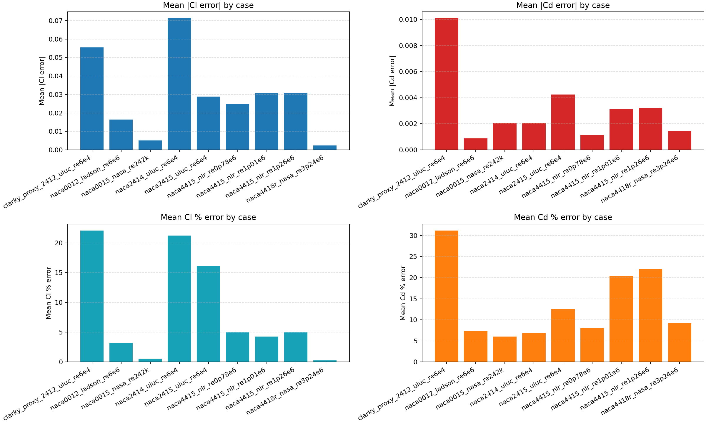

# Validation Snapshot

The aerodynamic estimate in Manta Airlab is a quick engineering check. It is not CFD and not a full XFOIL replacement.
Ground truth for validation is experimental reference data.

To keep this claim grounded, the repository includes a benchmark suite based on UIUC, NASA, and NLR/OSU reference data.

## Ground truth policy

- Source of truth: experimental aerodynamic data (wind-tunnel / published test datasets).
- `XFOIL` is useful for higher-fidelity on-the-fly analysis, but it is not the final truth source.
- The quick model is for fast screening and first-pass design decisions.
- Any reported benchmark accuracy should always be interpreted against experimental references first.

## Current summary

Across all included cases in this snapshot:

- mean `Cl` % error ranges from `0.27%` to `20.43%`
- mean `Cd` % error ranges from `6.04%` to `22.00%`

In the best-supported cases:

- mean `Cl` % error is typically around `0.3%` to `5.0%`
- mean `Cd` % error is typically around `6.0%` to `8.0%`

Important scope note:

- this benchmark run measures the CLI `analyze` path (NACA quick model) against experimental data
- it does not benchmark Library interpolation mode from `database/airfoil.db`
- it does not benchmark on-the-fly `XFOIL` reruns

## Benchmark table (snapshot: 12 April 2026, refreshed 21:04 local)

Source: `../benchmarks/results/benchmark_summary.csv` (`8` cases, `99` points total).

| Case | Points | Mean Cl % error | Mean Cd % error | RMSE Cl | RMSE Cd |
|---|---:|---:|---:|---:|---:|
| naca0012_ladson_re6e6 | 15 | 3.23% | 7.40% | 0.0247 | 0.0011 |
| naca0015_nasa_re242k | 11 | 0.55% | 6.04% | 0.0151 | 0.0044 |
| naca2414_uiuc_re6e4 | 11 | 20.43% | 6.88% | 0.0701 | 0.0024 |
| naca2415_uiuc_re6e4 | 11 | 16.08% | 12.56% | 0.0376 | 0.0050 |
| naca4415_nlr_re0p78e6 | 12 | 4.98% | 8.01% | 0.0346 | 0.0018 |
| naca4415_nlr_re1p01e6 | 14 | 4.27% | 20.38% | 0.0519 | 0.0045 |
| naca4415_nlr_re1p26e6 | 13 | 4.95% | 22.00% | 0.0502 | 0.0049 |
| naca4418r_nasa_re3p24e6 | 12 | 0.27% | 9.16% | 0.0059 | 0.0021 |

Aggregate means from the same snapshot:

- Weighted mean `Cl` % error: `6.50%`
- Weighted mean `Cd` % error: `11.80%`
- Weighted mean `|Cl|` error: `0.0251`
- Weighted mean `|Cd|` error: `0.0023`

## Benchmark assets

- Script: `../benchmarks/compare_cli_vs_reference.py`
- Cases: `../benchmarks/cases/*.json`
- Reference data: `../benchmarks/data/*.csv`
- Reports: `../benchmarks/results/*_report.md`
- Summary chart: `../benchmarks/results/benchmark_summary.png`

## Positioning

Manta Airlab helps users reach a better first approximation faster:

- rapid geometry iteration
- immediate quick-aero feedback
- direct export for downstream work

It does not replace CFD, wind-tunnel testing, or physical validation.

## Source notices

Benchmark-source notices and required attributions are in [`THIRD_PARTY_NOTICES.md`](THIRD_PARTY_NOTICES.md).

